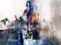
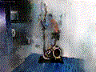
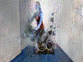
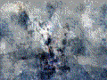
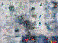
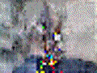
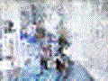
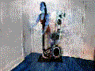
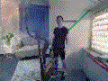

# Master-Thesis: Bewegungserkennung auf mobilen Geräten mit Verwendung von GANs für eine automatische Datensatzgenerierung

## Literatur
* K. Liu, Y. Ye, X. Li and Y. Li: **A Real-Time Method to Estimate Speed of Object Based on Object Detection and Optical Flow Calculation** ([PDF](https://iopscience.iop.org/article/10.1088/1742-6596/1004/1/012003/pdf), [BibTeX](https://iopscience.iop.org/export?articleId=1742-6596/1004/1/012003&doi=10.1088/1742-6596/1004/1/012003&exportFormat=iopexport_bib&exportType=abs&navsubmit=Export+abstract))
* M. Mandal, L. K. Kumar, M. S. Saran and S. K. Vipparthi: **MotionRec: A Unified Deep Framework for Moving Object Recognition** ([PDF](https://openaccess.thecvf.com/content_WACV_2020/papers/Mandal_MotionRec_A_Unified_Deep_Framework_for_Moving_Object_Recognition_WACV_2020_paper.pdf), [BibTeX](https://openaccess.thecvf.com/content_WACV_2020/html/Mandal_MotionRec_A_Unified_Deep_Framework_for_Moving_Object_Recognition_WACV_2020_paper.html))
* Y. Yang, A. Loquercio, D. Scaramuzza, S. Soatto: **Unsupervised Moving Object Detection via Contextual Information Separation** ([PDF](https://arxiv.org/pdf/1901.03360), [BibTeX](https://arxiv.org/abs/1901.03360))
* X. Mao, Q. Li, H. Xie, R. Y.K. Lau, Z. Wang, S. P. Smolley: **Least Squares Generative Adversarial Networks** ([PDF](https://arxiv.org/pdf/1611.04076.pdf), [BibTeX](https://arxiv.org/abs/1611.04076))
* M. Arjovsky, S. Chintala, L. Bottou: **Wasserstein GAN** ([PDF](https://arxiv.org/pdf/1701.07875) [BibTeX](https://arxiv.org/abs/1701.07875))
* I. Gulrajani, F. Ahmed, M. Arjovsky, V. Dumoulin, A. Courville: **Improved Training of Wasserstein GANs**, ([PDF](https://arxiv.org/pdf/1704.00028), [BibTeX](https://arxiv.org/abs/1704.00028))

## Videos
* [Creating Videos with Neural Networks using GAN](https://www.youtube.com/watch?v=CIua95jUD_I)

## Blogs
* [Meow Generator](https://ajolicoeur.wordpress.com/cats/): Vergleich zwischen GAN-Modellen zum Generieren von Katzenbildern

## Experimente und Messungen

| #   | Datensatz | Epochen | Output-Shape | Ergebnisse |
| --- | --------- | ------- | ------------ | ---------- |
| 1 | 2021-05-01-164113   [Generator](./evaluation/2021-05-01-164113/generator.txt)  [Diskriminator](./evaluation/2021-05-01-164113/discriminator.txt) | 9870 | (None, 40, 80, 180, 3) |  |
| 2 | 2021-05-02-135730   [Generator](./evaluation/2021-05-02-135730/generator.txt)  [Diskriminator](./evaluation/2021-05-02-135730/discriminator.txt) | 9870 | (None, 40, 80, 180, 3) |  |
| 3 | 2021-05-03-172829   [Generator](./evaluation/2021-05-03-172829/generator.txt)  [Diskriminator](./evaluation/2021-05-03-172829/discriminator.txt) | 2000 | (None, 40, 80, 180, 3) |  |
| 4 | 2021-05-04-023451   [Generator](./evaluation/2021-05-04-023451/generator.txt)  [Diskriminator](./evaluation/2021-05-04-023451/discriminator.txt) | 4950 | (None, 40, 80, 180, 3) |  |
| 5 | 2021-05-04-064157   [Generator](./evaluation/2021-05-04-064157/generator.txt)  [Diskriminator](./evaluation/2021-05-04-064157/discriminator.txt) | 5000 | (None, 40, 80, 180, 3) |  |
| 6 | 2021-05-06-024533   [Generator](./evaluation/2021-05-06-024533/generator.txt)  [Diskriminator](./evaluation/2021-05-06-024533/discriminator.txt) | 3000 | (None, 40, 360, 480, 3) |  |
| 7 | 2021-05-07-135545   [Generator](./evaluation/2021-05-07-135545/generator.txt)  [Diskriminator](./evaluation/2021-05-07-135545/discriminator.txt) | 3000 | (None, 60, 360, 480, 3) |  |
| 8 | 2021-05-08-142259   [Generator](./evaluation/2021-05-08-142259/generator.txt)  [Diskriminator](./evaluation/2021-05-08-142259/discriminator.txt) | 3000 | (None, 60, 36, 48, 3) |  |
| 9 | 2021-05-08-154506   [Generator](./evaluation/2021-05-08-154506/generator.txt)  [Diskriminator](./evaluation/2021-05-08-154506/discriminator.txt) | 3000 | (None, 60, 36, 48, 3) |  |
| 10 | 2021-05-08-191517   [Generator](./evaluation/2021-05-08-191517/generator.txt)  [Diskriminator](./evaluation/2021-05-08-191517/discriminator.txt) | 3000 | (None, 120, 96, 128, 3) |  |
| 11 | 2021-05-09-194241   [Generator](./evaluation/2021-05-09-194241/generator.txt)  [Diskriminator](./evaluation/2021-05-09-194241/discriminator.txt) | 1500 | (None, 120, 96, 128, 3) |  |

## Inhalt der Thesis

* Einführung in GANs
    - Theorie
    - Mode-Collapse
    - Deep Convolution GAN
    - Wasserstein GAN
    - Wasserstein GAN-GP
    - Unrolled GAN
    - Least Squares GAN
* Erstellen eines Datensatzes
    - Rahmenbedingungen
    - Verwendung von GANs
    - Messung unterschiedlicher GANs
    - Analyse der Ergebnisse
